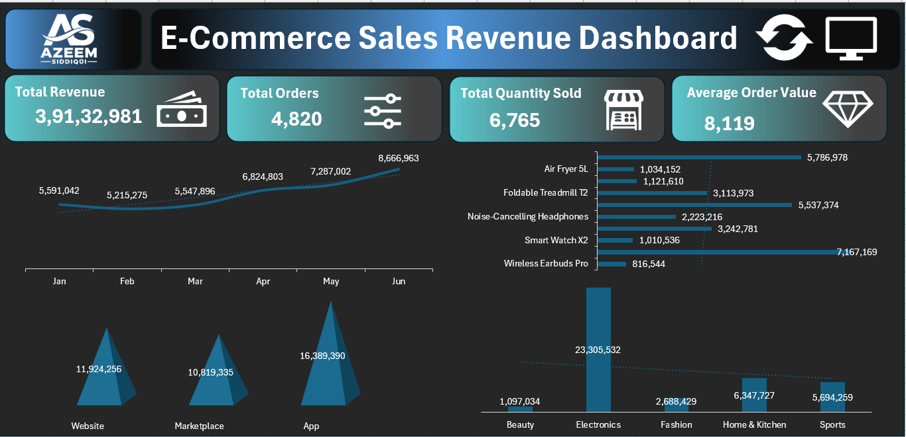

# 📊 E-Commerce Sales Dashboard – Excel

## 📌 Project Overview

This project is an E-Commerce Sales Dashboard created using Microsoft Excel.

The dashboard helps analyze sales performance, profit, quantity sold, products, categories, cities, stores, and monthly sales trends through interactive visualizations.

## 🎯 Project Objectives

- Analyze overall sales performance
- Track total sales and profit
- Analyze quantity sold
- Identify top-performing products
- Compare sales across categories
- Analyze sales by city and store
- Understand monthly sales trends
- Create an interactive and easy-to-understand dashboard

## 🛠️ Tools & Skills Used

- Microsoft Excel
- Data Cleaning
- Excel Formulas
- Pivot Tables
- Pivot Charts
- Slicers
- Data Visualization
- Dashboard Design

## 📊 Dashboard Features

- 💰 Total Sales
- 📈 Total Profit
- 📦 Total Quantity Sold
- 🛍️ Sales by Category
- 🏙️ Sales by City
- 🏪 Sales by Store
- 📦 Sales by Product
- 📅 Monthly Sales Trend
- 🎛️ Interactive Slicers

## 🖼️ Dashboard Preview

## 📥 Project File

[⬇️ Download E-Commerce Sales Dashboard Excel File](./E-Commerce_Sales_Dashboard.xlsx)

## 📁 Repository Structure

E-Commerce-Sales-Dashboard-Excel/

├── 📁 image/

│   └── E-Commerce_Sales_Dashboard.png

├── 📊 E-Commerce_Sales_Dashboard.xlsx

└── 📄 README.md

## 👨‍💻 Author

### Mohd Azeem

**Aspiring Data Analyst**

**Skills:** Excel | SQL | Power BI | Python

---

⭐ **Thank you for visiting this project!**
